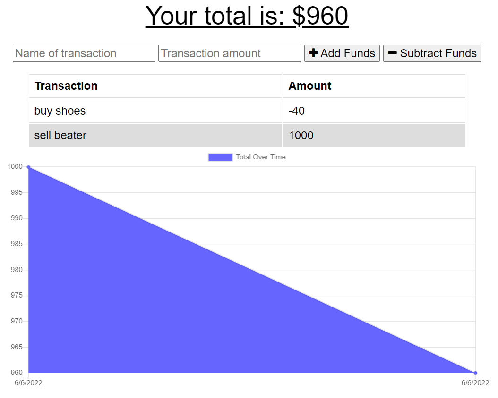

# yeehaw-commerce
Object-Relational Mapping (ORM) Challenge: E-commerce Back End - challenge 13

## Table of Contents
- [Description](#description)  
- [Deployment](#deployment)  
- [Contributions](#contributions)  
- [License](#license)  
- [Technologies](#technologies)  
- [Installation](#installation) 
- [Screenshot](#screenshot)
- [Questions](#questions)  
  
## Description
Giving users a fast and easy way to track their money is important, but allowing them to access that information at any time is even more important. Having offline functionality is paramount to the success of an application that handles users’ financial information.

The goal of this app was to update an existing budget tracker application to allow for offline access and functionality. The user can add expenses and deposits to their budget with or without a connection. If the user enters transactions offline, the total will be updated when they're brought back online.
  
## Deployment  
To run this app on your local machine, you will want to clone this repository. You will need to make sure that you have Node.js installed, as well as MongoDB. Once you have cloned the repo, use the terminal to navigate to the project's root directory and type the following: `npm install`. Followed by, `npm start`. If you need some guidance on installing these dependencies, please refer to the links below.

## Dependencies
* [How to Install Node.js and NPM on Windows](https://phoenixnap.com/kb/install-node-js-npm-on-windows)
* [How to install Node.js and npm on macOS](https://www.newline.co/@Adele/how-to-install-nodejs-and-npm-on-macos--22782681)
* [How to install MongoDB](https://www.mongodb.com/docs/manual/installation/)
  
## Contributions
Antony Quinones 
  
## License
 
This application is covered by the MIT license. 
  
## Technologies  
 

  
## Screenshot

  
## Questions  
GitHub: [Antony-Q](https://github.com/Antony-Q) 
Contact me with any questions at antonyantonyqq@gmail.com 
Copyright 2022 © AllRights Reserved. 